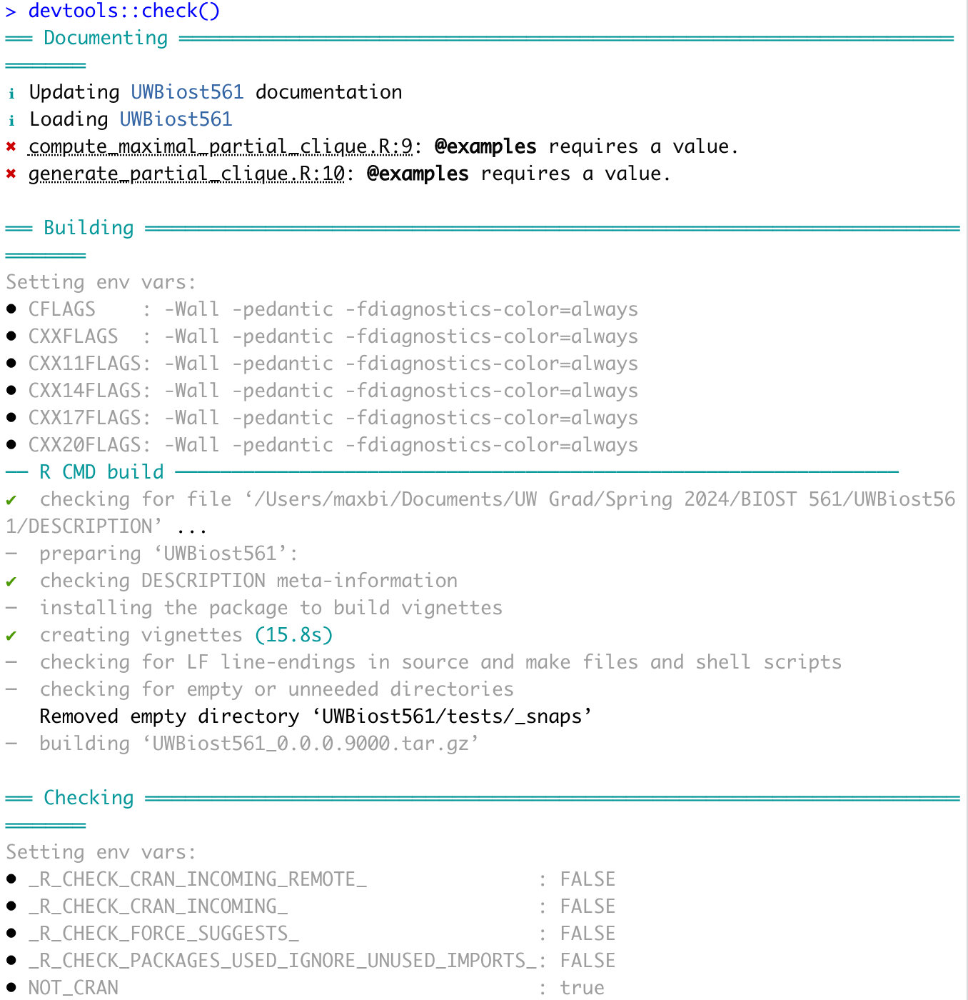
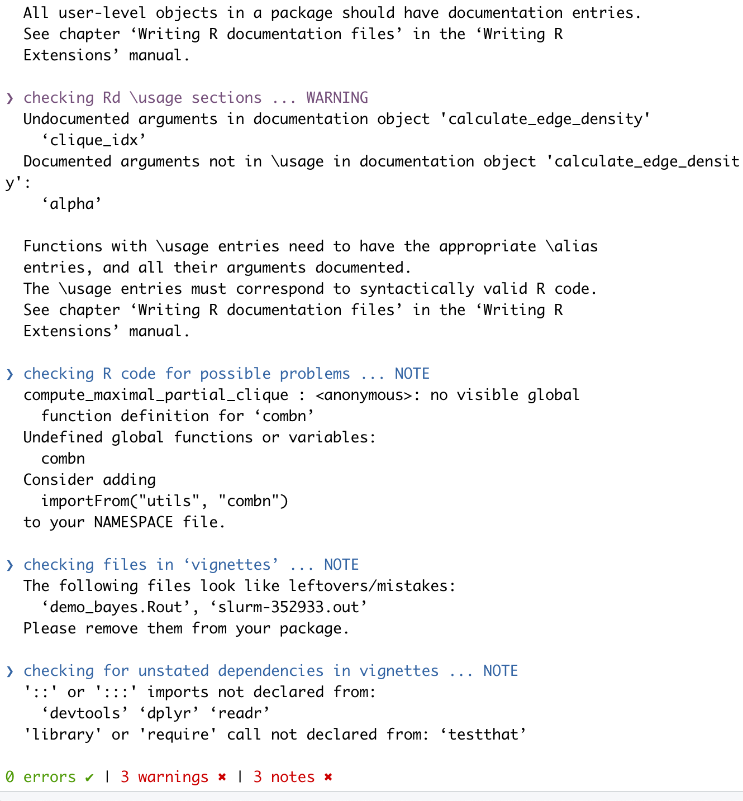

```{r, include = FALSE}
knitr::opts_chunk$set(
  collapse = TRUE,
  comment = "#>"
)
library(bookdown)
library(devtools)
library(tidyverse)
library(ggplot2)
library(UWBiost561)
```

# Q1: 

## Part A

N/A

## Part B

N/A

## Part C

N/A

## Part D

```{r}
set.seed(0)
simulation = UWBiost561::generate_partial_clique(
  n = 10,
  clique_fraction = 0.5,
  clique_edge_density = 0.9
)

simulation$adj_mat
```

```{r}
set.seed(0)
simulation <- UWBiost561::generate_partial_clique(
  n = 10,
  clique_fraction = 0.5,
  clique_edge_density = 0.9
)

adj_mat <- simulation$adj_mat

res <- UWBiost561::compute_maximal_partial_clique(
  adj_mat = adj_mat,
  alpha = 0.9
)
res
```

# Problem 2

## Part A

N/A

## Part B

N/A

## Part C

```{r}
set.seed(0)
simulation <- UWBiost561::generate_partial_clique(
  n = 10,
  clique_fraction = 0.5,
  clique_edge_density = 0.9
)

adj_mat <- simulation$adj_mat

res <- UWBiost561::compute_maximal_partial_clique(
  adj_mat = adj_mat,
  alpha = 0.9
)
res
```

# Problem 3

## Part A

N/A

## Part B

N/A

## Part C

N/A

## Part D

N/A

# Problem 4

## Part A

N/A

## Part B

N/A

## Part C

{width=50%}

{width=50%}

## Part D

```{r, eval=FALSE}
devtools::session_info()
```

# Problem 5

## Part A

I can access open sesame

## Part B

I'm currently doing a research project for Prof. Jim Hughes where I am contributing along with some other statisticians in the program to a package that will calculate robust variance estimates for glmer objects in R. The function is going to be able to calculate said estiamtes for various link functions as well as implement small sample adjustments derived in previous literature.

## Part C

N/A

# LLM Appendix

Used ChatGPT for ~10 generations of both `generate_partial_clique` and `compute_maximal_partial_clique` functions. Most debugging was done by myself, but I did ask ChatGPT to correct its own errors at times.
